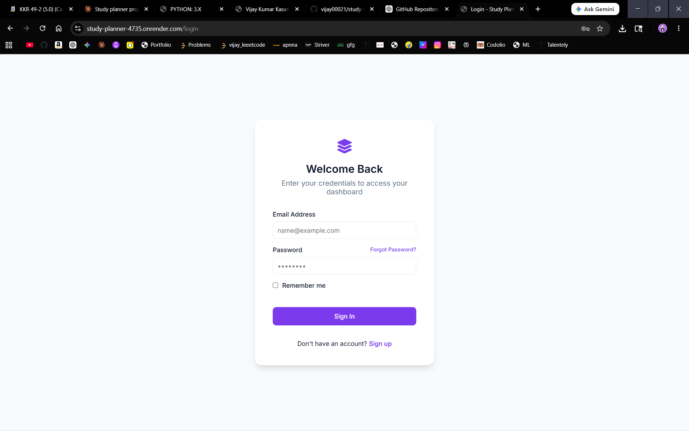
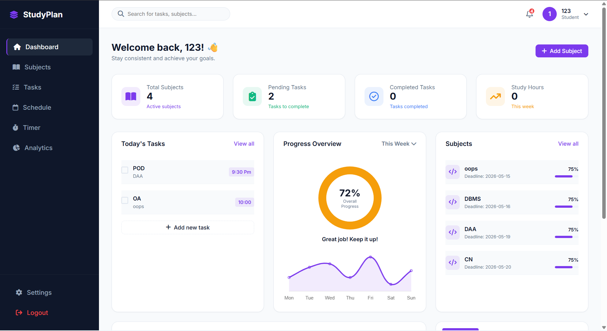
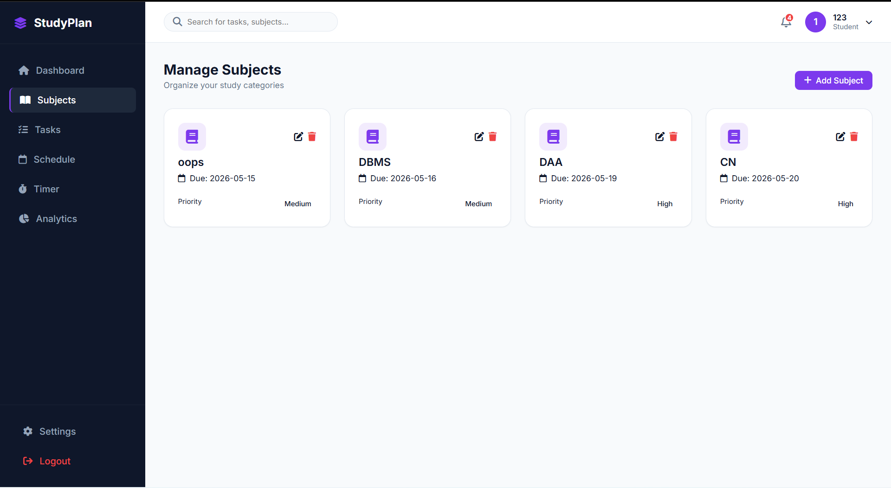
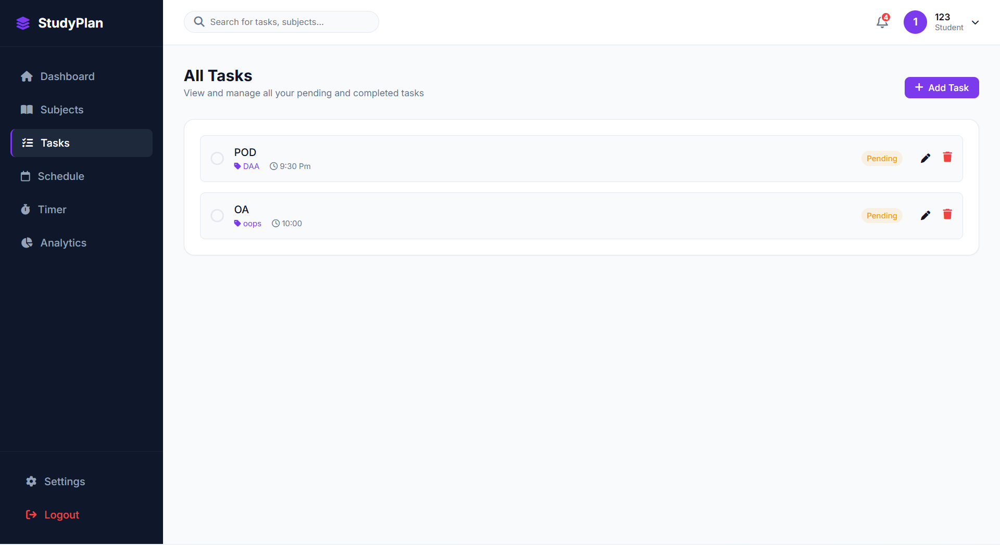
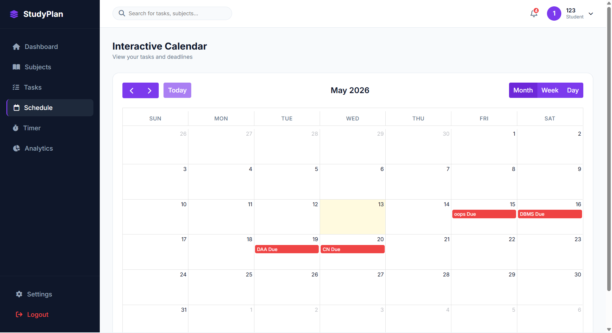
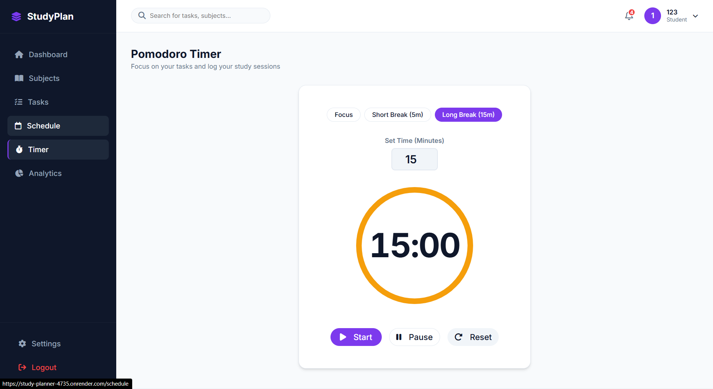

# 📚 StudyPlan – Smart Study Planner Web App

A modern and responsive study planner web application designed to help students organize subjects, manage tasks, track deadlines, and improve productivity with an integrated Pomodoro timer and analytics dashboard.

---

# 🚀 Live Demo

🔗 https://study-planner-4735.onrender.com

---

# ✨ Features

## 🔐 Authentication System
- User Registration & Login
- Secure Authentication
- Session Management
- Logout Functionality

## 📊 Dashboard
- Overview of total subjects
- Pending & completed tasks
- Progress tracking
- Upcoming deadlines
- Weekly analytics

## 📚 Subject Management
- Add subjects
- Edit subjects
- Delete subjects
- Priority management
- Deadline tracking

## ✅ Task Management
- Create study tasks
- Edit/Delete tasks
- Track pending tasks
- Organize tasks by subjects

## 📅 Interactive Calendar
- Monthly calendar view
- Deadline visualization
- Schedule management

## ⏳ Pomodoro Timer
- Focus sessions
- Short breaks
- Long breaks
- Start/Pause/Reset functionality

## 📈 Analytics
- Productivity overview
- Study progress tracking
- Weekly performance insights

## 🎨 Modern UI/UX
- Responsive design
- Professional dashboard layout
- Clean sidebar navigation
- Smooth user experience

---

# 🛠️ Tech Stack

## Frontend
- HTML5
- CSS3
- JavaScript

## Backend
- Python
- Flask

## Database
- SQLite

## Deployment
- Render

---

# 📂 Project Structure

```bash
study-planner/
│
├── models/
├── static/
│   ├── css/
│   ├── js/
│   └── images/
│
├── templates/
│   ├── login.html
│   ├── register.html
│   ├── dashboard.html
│   ├── subjects.html
│   ├── tasks.html
│   ├── schedule.html
│   └── timer.html
│
├── screenshots/
│   ├── register.png
│   ├── login.png
│   ├── dashboard.png
│   ├── calendar-dashboard.png
│   ├── subjects.png
│   ├── tasks.png
│   ├── schedule.png
│   └── timer.png
│
├── app.py
├── extensions.py
├── requirements.txt
├── render.yaml
└── README.md
```

---

# ⚙️ Installation

## 1️⃣ Clone the Repository

```bash
git clone https://github.com/vijay00021/study-planner.git
cd study-planner
```

---

## 2️⃣ Create Virtual Environment

### Windows
```bash
python -m venv venv
venv\Scripts\activate
```

### Mac/Linux
```bash
python3 -m venv venv
source venv/bin/activate
```

---

## 3️⃣ Install Dependencies

```bash
pip install -r requirements.txt
```

---

## 4️⃣ Run the Application

```bash
python app.py
```

---

## 5️⃣ Open in Browser

```txt
http://127.0.0.1:5000
```

---

# 📖 Usage

## 👤 Register Account
Create an account using the registration page.

## ➕ Add Subjects
Add subjects with:
- Subject name
- Priority
- Deadline

## ✅ Manage Tasks
Create and organize study tasks efficiently.

## 📅 Track Deadlines
Use dashboard and calendar to monitor deadlines.

## ⏳ Focus with Pomodoro Timer
Boost productivity using focus sessions and breaks.

## 📊 Analyze Progress
Monitor study consistency and task completion.

---

# 🌐 Deployment

This project is deployed using Render.

## Deploy on Render

### Build Command
```bash
pip install -r requirements.txt
```

### Start Command
```bash
gunicorn app:app
```

---

# 📸 Screenshots

## 🔐 Register Page


---

## 🔑 Login Page


---

## 📊 Dashboard


---

## 📅 Dashboard Calendar & Deadlines


---

## 📚 Subjects Management


---

## ✅ Tasks Management


---

## 🗓️ Interactive Schedule


---

## ⏳ Pomodoro Timer


---

# 🔮 Future Improvements

- Dark mode support
- Email notifications
- Mobile responsive optimization
- AI study recommendations
- Google Calendar integration
- Notes section
- File uploads
- Study streak tracking

---

# 🤝 Contributing

Contributions are welcome!

1. Fork the repository
2. Create feature branch
3. Commit changes
4. Push to branch
5. Open Pull Request

---

# 👨‍💻 Author

## Vijay Goud

- GitHub: https://github.com/vijay00021

---

# ⭐ Support

If you like this project, give it a ⭐ on GitHub!